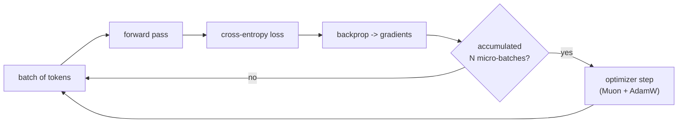

# 5. Training: loss, backprop, optimizers, and the tricks that make it work

We have the machine (Chapters 3–4). Now: how do its millions of random numbers become good ones?
The loop is simple to state and full of important details.

## 5.1 The loss: cross-entropy

For each position, the model outputs a probability distribution over the next token. The target is
the token that *actually* came next. **Cross-entropy loss** = `−log(probability the model assigned
to the correct token)`. If the model gave the right token probability 1.0, loss is 0. If it gave it
a tiny probability, loss is large. We average this over every position in the batch.

We compute it at every position at once: a sequence `[t1, t2, t3, t4]` gives four training signals
(predict t2 from t1, t3 from t1t2, …) in a single forward pass — efficient, thanks to the causal
mask (Chapter 3).

▶ **In MathNano** initial loss was `ln(32768) ≈ 10.40` (random model, Chapter 1) and fell to ~1.44
by the end of pretraining. The reported **bits-per-byte** (Chapter 2) is just this loss rescaled to
be vocab-independent.

## 5.2 Backpropagation and gradient descent

- **Forward pass**: run the batch through the model, get the loss.
- **Backward pass (backprop)**: automatic differentiation computes the *gradient* — for every
  parameter, the direction and rate at which it would change the loss.
- **Optimizer step**: nudge each parameter a small amount *against* its gradient (downhill on the
  loss surface). The step size is the **learning rate (LR)**.

Repeat for millions of batches. That's it — the whole of "learning" is iterated downhill steps. The
residual connections (Chapter 3) matter here: they give the gradient a direct path back through
every layer, so even deep models get a clean training signal.



## 5.3 Optimizers: AdamW (and Muon)

Plain gradient descent is noisy. **AdamW** — the standard — keeps running averages of each
parameter's gradient (momentum) and its squared gradient (a per-parameter adaptive scale), so it
takes confident steps in consistent directions and small steps in noisy ones. The "W" is *weight
decay*: gently pulling weights toward zero each step, a regularizer that improves generalization.

▶ **In MathNano**, nanochat uses **Muon** for the 2-D weight matrices and AdamW for the 1-D
parameters (embeddings, scales). Muon orthogonalizes each matrix's gradient update (via a few
Newton–Schulz iterations) so the update directions are decorrelated — empirically faster, more
stable convergence. You don't need to implement it to use it, but it's why our run was efficient.

## 5.4 Learning-rate schedule

You don't use a constant LR. The standard shape: **warm up** linearly from ~0 for the first few
hundred steps (so early, wild gradients don't blow things up), hold near a peak, then **decay** back
toward ~0 (so late training settles into a good minimum). ▶ In MathNano you can see this in the
`lrm` column of our training logs rising then falling over the 5,376 steps.

## 5.5 Batch size and gradient accumulation

Bigger **batches** (more tokens per step) give less-noisy gradient estimates and more stable
training — but they cost proportional memory. A single 24 GB GPU can't hold nanochat's target batch
(~500k tokens) at once. **Gradient accumulation** is the workaround: run several small "micro-batches"
forward+backward, *sum* their gradients without stepping, then take one optimizer step. The result is
mathematically identical to one big batch, trading wall-clock time for memory.

▶ **In MathNano** the log showed `Total batch size 524,288 => gradient accumulation steps: 64`: we
processed 64 micro-batches of 8,192 tokens each, then stepped once. That's how a 24 GB card trains
with a half-million-token effective batch.

## 5.6 Precision: bf16

Training in 32-bit floats is accurate but memory-heavy and slow. **bf16** (bfloat16) is a 16-bit
format with the *same exponent range* as fp32 (so it handles big/small numbers without overflow)
but fewer mantissa bits (less precision). It halves memory and speeds up matmuls on modern GPUs, and
it's now the default for LLM training. Sensitive reductions (like the norm) are often still done in
fp32 internally for stability.

## 5.7 MFU: are you actually using the GPU?

**Model-FLOPs-Utilization (MFU)** = the fraction of the GPU's theoretical peak compute your run
actually achieves. It's the single best "is my training efficient?" number. Below ~20% something is
wrong (usually a data-loading bottleneck or a bad config); 40%+ is good.

▶ **In MathNano** MFU was the lever for our biggest live optimization. With the sliding-window
attention path on our GPU, MFU was ~35%. Switching to full-context attention (`--window-pattern=L`,
forced by the SDPA limitation in Chapter 3) pushed it to **~72%** and ~66k tokens/sec — turning a
projected multi-day run into ~11.8 hours.

## 5.8 Putting numbers to it: what a run looks like

A healthy MathNano training log line:
```
step 04000/05376 | loss: 1.65 | lrm: 0.42 | tok/sec: 66,000 | bf16_mfu: 72.9 | eta: 181m
```
That's: ~74% through, loss well down from 10.4, LR decaying, 66k tokens/sec, 73% GPU utilization,
3 hours left. Reading that line fluently — knowing every field — *is* understanding training.

## What breaks without this
- Wrong **loss**: you optimize the wrong thing; the model learns nothing useful.
- No **warmup**: early giant gradients can NaN the run in the first dozen steps.
- No **gradient accumulation**: you're capped at whatever tiny batch fits in memory → noisy,
  unstable training.
- Ignoring **MFU**: you silently pay 2–5× more for the same result (we'd have wasted days and most
  of the budget without the attention fix).

→ Next: [Pretraining](06-pretraining.md) — running this loop for real.
