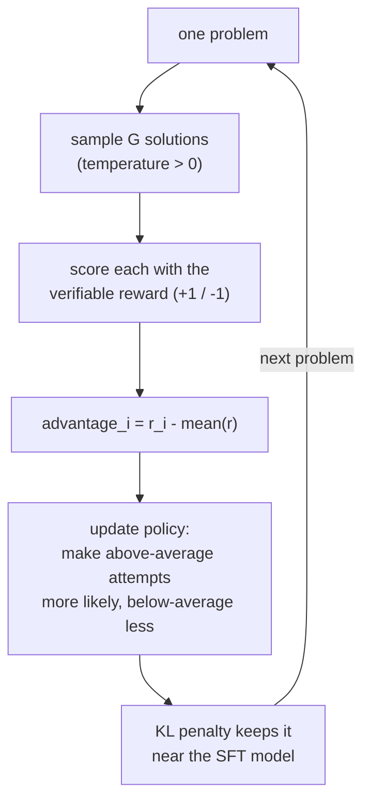

# 8. Reinforcement learning with verifiable rewards (GRPO) — and how we broke it

SFT teaches the model to *imitate* good solutions. But imitation has a ceiling: the model copies the
*form* of correct answers without being optimized for *being correct*. Reinforcement learning (RL)
closes that gap — it optimizes the model directly for an outcome we care about: **getting the right
answer.** This is the stage that made DeepSeek-R1 impressive, and we ran a scaled-down version of the
exact same recipe. It's also where we got our most instructive failure.

## 8.1 Why math is special: verifiable rewards

RL needs a **reward**: a number saying how good an output was. For most tasks (e.g. "write a helpful
reply") there's no objective reward, so labs train a separate *reward model* from human preferences
(RLHF) — expensive and fuzzy. Math is special: the answer is **checkable**. Extract the model's final
answer, compare it to the known ground truth. Correct → +1, wrong → −1. No humans, no reward model,
no ambiguity. This is a **verifiable reward**, and it's why math/code are the frontier of RL for
reasoning.

▶ **In MathNano** the reward is `mathnano/rewards/math_reward.py` — robustly extract the answer
(handle `\boxed{}`, `####`, units, fractions) and check equivalence (numeric within tolerance, or
symbolic via sympy). It has 64 unit tests, and we deliberately use the **same function** for RL
*and* evaluation so they can never disagree about what "correct" means.

## 8.2 GRPO, intuitively

**GRPO (Group Relative Policy Optimization)** is the RL algorithm nanochat and DeepSeek use. Per
problem:

1. **Sample a group** of `G` different solutions from the current model (e.g. G=4–8), using
   temperature > 0 so they actually differ.
2. **Score each** with the verifiable reward → rewards `r₁ … r_G`.
3. **Compute each solution's advantage** relative to the group: `advantage_i = r_i − mean(r)`
   (optionally ÷ std). The baseline is just "how this attempt did compared to its siblings."
4. **Update the policy** to make above-average solutions *more* likely and below-average ones *less*
   likely.

The "group relative" trick is what makes it simple and stable: you don't need an absolute reward
scale or a separate value network — you just ask "which of these attempts were better than the
group's average?" A small **KL penalty** keeps the updated model from drifting too far from the SFT
model (prevents it from collapsing into reward-hacking gibberish).

This is genuinely the R1 recipe: pretrain → SFT → GRPO-with-verifiable-rewards. We ran it at roughly
1/50,000th the budget.

## 8.3 What happened to us: collapse

We ran 400 GRPO steps on the SFT'd Qwen model, then evaluated:

| | GSM8K | MATH |
|---|---|---|
| SFT (before) | 39.0% | 40.0% |
| **GRPO (after)** | **5.5%** | **5.5%** |

GRPO didn't improve the model — it **catastrophically degraded** it, across every difficulty level.
The training reward had been flat and noisy throughout (a warning sign we noted live). This is a real
failure, and diagnosing it taught more than a clean success would have.

## 8.4 Root cause: the reward was lying

Here's the chain, and it's a perfect illustration of an RL failure mode:

1. **On a single GPU we couldn't run vLLM** (the fast rollout engine TRL wants); we fell back to
   plain HuggingFace generation.
2. In that fallback path, **generation never stopped at the answer** — the model rarely emits its
   stop token (`<|im_end|>`, Chapter 2), so every rollout ran to the 400-token cap: "…\boxed{correct
   answer}… + 250 tokens of rambling/repetition."
3. Our extractor reads the **last** boxed/number in the text. With all that trailing garbage, it
   frequently grabbed the wrong thing — **grading correct solutions as wrong.**
4. GRPO faithfully optimized that corrupted signal. Punished for good behavior, the policy drifted
   away from its strong SFT distribution → collapse.

**The lesson — the most important one in the course:** *GRPO is only as good as the fidelity of its
reward.* RL optimizes exactly what you measure, so if your measurement is broken, RL will
enthusiastically make your model worse. The reward function and the rollout setup are not plumbing —
they *are* the algorithm.

## 8.5 How you'd fix it (future work)
- **Clean rollouts:** make generation stop at the answer — either real vLLM rollouts (which respect
  stop tokens), or force the stop in the HF path (we did exactly this for *serving* in Chapter 10:
  stop the instant a complete `\boxed{}` appears).
- **Robust reward:** read the *first* boxed answer, or truncate the completion at the stop marker
  before extracting, so trailing rambling can't corrupt the score.
- Then rerun — with a trustworthy reward, GRPO should *improve* over SFT, which is the whole point.

We shipped the **SFT** model (the winner) and documented the GRPO collapse honestly in `RESULTS.md`.
A negative result with a clear root cause is a stronger demonstration of understanding than a lucky
success — and in interviews/portfolios, far more convincing.

## What breaks without this
Without RL, the model is capped at imitating its SFT data — it never directly optimizes for being
*right*, only for looking like correct solutions. RL-with-verifiable-rewards is how you push past the
imitation ceiling. But this chapter's harder lesson is the inverse: **bad RL is worse than no RL** —
a corrupted reward doesn't leave the model unchanged, it actively destroys it.

→ Next: [Evaluation](09-evaluation.md)
