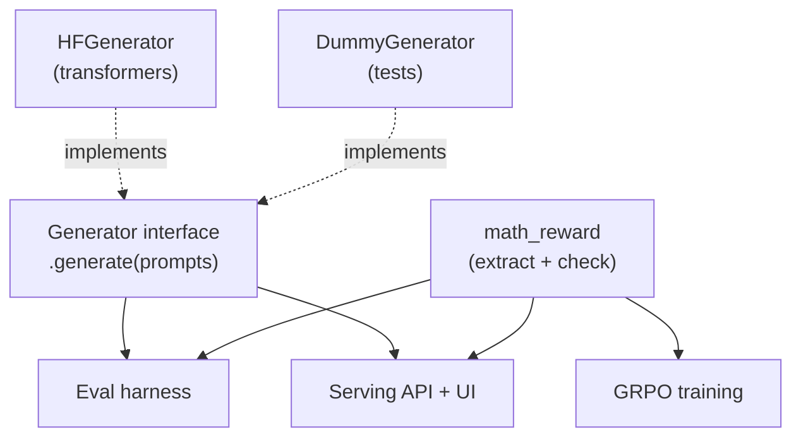

# 10. The verifiable reward, inference, and serving

A model sitting in a checkpoint file is useless. This chapter covers the three pieces that make it a
*product*: the reward function (the project's source of truth for "correct"), inference (turning the
model into answers efficiently), and serving (the API + UI you can actually use).

## 10.1 The verifiable reward: one function, three jobs

`mathnano/rewards/math_reward.py` is the most reused code in the project. It does two things:

**Extract** the model's final answer from free-form text, most-reliable cue first:
1. `\boxed{...}` (competition convention) — brace-balanced, so it handles `\boxed{\frac{1}{2}}`.
2. GSM8K's `#### 42` marker.
3. "the answer is X" phrasing.
4. A trailing `= X`, or, last resort, the last number in the text.

**Compare** the extracted answer to ground truth, crediting genuine matches:
- exact match after normalization (strip `$`, units, `\left`/`\right`, thousands commas…);
- numeric equality within a tolerance (`0.3333` ≈ `1/3`);
- symbolic equality via sympy (`2/4` = `1/2`, `(x+1)^2` = `x^2+2x+1`).

It's used by **(1)** GRPO training (the reward), **(2)** the eval harness (the metric), and **(3)**
the serving layer (to surface a clean extracted answer). One source of truth means training, scoring,
and the product can never disagree about correctness — and it's covered by **64 unit tests**, because
a bug here silently corrupts everything (as Chapter 8 showed when the *inputs* to it were bad).

## 10.2 Inference: generation, and the KV cache

Generation is the autoregressive loop (Chapter 1): predict a token, append, repeat. The naive
version recomputes attention over the entire growing sequence every step — `O(T²)` total, painfully
slow. The fix is the **KV cache**: the Keys and Values for past tokens don't change as you generate,
so compute them once and *store* them; each new token only computes its own K/V and attends to the
cache. This turns per-step cost from "re-process everything" into "process one token," and is why
real chat is fast. (It's also the main memory consumer during generation, which is why
memory-saving attention variants like GQA exist — though nanochat doesn't use GQA, Chapter 3.)

## 10.3 The stop-token saga (our recurring villain)

The single bug that bit us most: **the model doesn't reliably emit its stop token** (`<|im_end|>`),
so generation runs to the length cap every time. We met it three times:
- **In RL** it corrupted the reward → model collapse (Chapter 8).
- **In serving on CPU** it made even "1+1" take ~2 minutes (it generated 384 tokens of rambling
  after "2").
- The fix, finally, in serving: a **stopping criterion that halts the instant a complete `\boxed{}`
  appears.** "1+1" went from ~2 minutes to **~10 seconds.**

The lesson: knowing *when to stop generating* is as important as what to generate, and for chat models
it hinges entirely on those tiny special tokens. We also clean the displayed solution (trim anything
after the answer) so the UI is tidy even when the raw generation isn't.

## 10.4 Serving: the API and UI

▶ **In MathNano**, `serve/` is the product layer, built to be **backend-agnostic**: it wraps the
same `Generator` interface the eval harness uses, so *the model you serve is exactly the model you
benchmarked.* It exposes a small **FastAPI** server:
- `POST /solve` → `{answer, solution}` for one problem,
- `POST /chat` and `/chat/stream` for conversational use,
- `GET /` → a minimal web chat UI (with LaTeX rendering via MathJax, example problems, and a
  "solving…" indicator),
- `GET /health` → liveness + which model is loaded.

It loads the base model + our LoRA adapter straight from HuggingFace, configurable by environment
variables (`MATHNANO_MODEL`, `MATHNANO_ADAPTER`, `MATHNANO_DEVICE`). It runs on CPU (slow but free,
on a laptop) or GPU (instant), and there's a Dockerfile for deployment. A `DummyGenerator` lets the
whole API be tested with no model at all (fast, dependency-free CI).

One `Generator` and one `math_reward`, reused across training, evaluation, and serving — so the
model you ship is provably the model you measured, scored by the same correctness rule everywhere.

## 10.45 Tool use: a calculator that corrects the model

The model's main failure mode is *arithmetic slips* in otherwise-correct reasoning (it knows the
method, fumbles the multiplication). The fix isn't more training — it's **tool use**: let an exact
calculator do the arithmetic. ▶ `mathnano/tools/calculator.py` reads the model's own solution,
recomputes every equation it wrote, flags mistakes, and corrects the final answer when it's a wrong
direct computation. Live example: the model output `384 × 27 = 10224`; the tool computed **10368**
and corrected the answer.

Two design points worth noting:
- **It's safe, not code execution.** Each expression is parsed to a Python AST and only numeric
  arithmetic nodes are evaluated — no names, calls, imports, or builtins ever run. "Running the
  model's math" with zero ability to run anything dangerous.
- **It's robust to how models write math** — prose prefixes ("we get 48/2 = 24"), LaTeX operators
  (`\times`), implicit multiplication (`5(3)`), and equations chained across lines (`= 384*27` then
  `= 10224`). Each of those was a real case we had to handle.

This is the cheapest large reliability win for a small model, and it generalizes: the next tool is a
full Python interpreter for multi-step computation (Chapter 12).

## 10.5 The shape of good product code
Notice the through-line: one `Generator` interface, one `math_reward`, one model artifact — reused
across training, eval, and serving. That's not architecture astronautics; it's what guarantees the
thing you demo is the thing you measured, and it's why adding the CPU device option or the stop-token
fix was a few lines, not a rewrite. Boring, consistent interfaces are a feature.

## What breaks without this
- A weak **reward/extractor**: you mis-grade correct answers — fatal for both RL (Chapter 8) and eval
  (Chapter 9).
- No **KV cache**: generation is quadratically slow; real-time chat is impossible.
- No **stop handling**: every answer runs to the length cap — slow, expensive, and (in RL) reward-
  corrupting.
- No **serving layer**: you have a checkpoint, not a product — nothing anyone can actually use or
  build on.

→ Next: [The real workflow, and the bugs](11-workflow-and-bugs.md)
