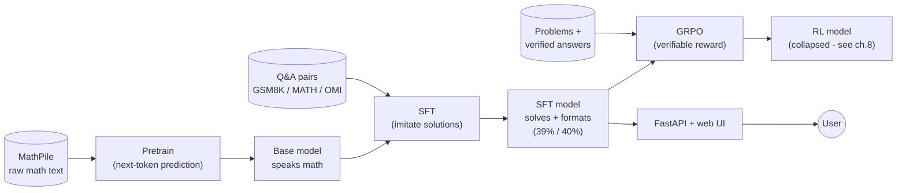

# Build an LLM From Scratch — the MathNano course

A complete, first-principles course on how large language models actually work, taught through a
real project: **MathNano**, where we trained a math-reasoning model two ways (from scratch, and by
fine-tuning a small open base) on a single GPU for ~£13, shipped it, and broke it instructively.

This is the course I wish existed: not just "what is a transformer," but every decision, every
number, every bug — connected to a thing we actually built. Where a concept shows up in our run,
you'll see a **▶ In MathNano** callout with the real value you can verify in the repo.

## Who this is for
You can read Python and have seen a neural network before (you know what a weight and a gradient
are). You do **not** need prior NLP/transformers knowledge. Every term is defined when it appears.

## How to read it
Top to bottom. Part 1 is the machine (how an LLM works). Part 2 is the recipe (how you turn it
into something useful). Part 3 is the engineering (how you measure and ship it). Part 4 is the
honest reflection. Each chapter ends with **"What breaks without this"** — the fastest way to
understand why a component exists is to know what fails when it's gone.

## The whole project at a glance

The three blue stages — **pretrain → SFT → RL** — are the recipe behind every modern chat model;
the rest of the diagram is data feeding in and the product coming out. Each is a chapter below.

## Contents

**Part 1 — The machine: how an LLM works**
1. [What a language model actually is](01-what-is-an-llm.md)
2. [Tokenization: turning text into numbers](02-tokenization.md)
3. [The transformer: embeddings, attention, and the residual stream](03-the-transformer.md)
4. [Positional information, normalization, and the MLP](04-rope-norm-mlp.md)
5. [Training: loss, backprop, optimizers, and the tricks that make it work](05-training.md)

**Part 2 — The recipe: pretrain → SFT → RL**
6. [Pretraining: learning to speak math from raw text](06-pretraining.md)
7. [Supervised fine-tuning: from autocomplete to assistant](07-sft.md)
8. [Reinforcement learning with verifiable rewards (GRPO) — and how we broke it](08-rl-grpo.md)

**Part 3 — Engineering: measure and ship**
9. [Evaluation: how to know if it actually works](09-evaluation.md)
10. [The verifiable reward, inference, and serving](10-reward-inference-serving.md)
11. [The real workflow: cloud GPUs, budgets, reproducibility, and the bugs](11-workflow-and-bugs.md)

**Part 4 — Reflection**
12. [Scaling laws, what we achieved, and where small models win](12-reflection.md)

## The one-paragraph summary (read this first)
An LLM is a function that, given a sequence of tokens, outputs a probability distribution over the
next token. You **pretrain** it on a huge pile of text so it learns the statistics of language
(and, with math text, the patterns of mathematical reasoning). You then **fine-tune** it on
question→answer examples so it follows instructions instead of just autocompleting. Optionally you
apply **reinforcement learning** with a reward that checks whether its answer is *correct*, so it
optimizes for being right rather than just plausible. Everything else — attention, RoPE, RMSNorm,
optimizers, tokenizers — is machinery in service of doing that next-token prediction well and
cheaply. This course explains all of it, bottom-up, using a model we really trained.
